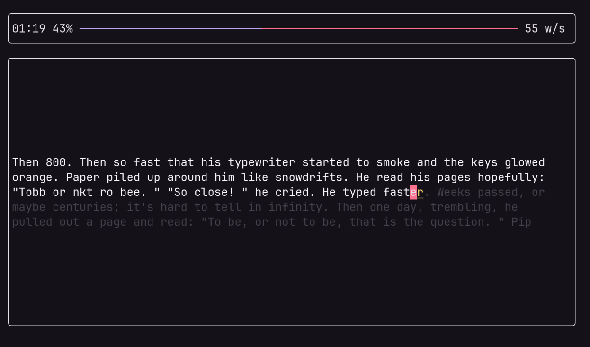

# Typetype
Typetype is a typing test that runs directly in your terminal, built with [Ratatui](https://ratatui.rs/)🐁.
No need to waste time opening your browser anymore. Just do it from your terminal.

## How to use it
### Build
```bash
cargo run --release
```
### Game mods
- *Race* You need to type a given test as fast as possible
- *Clock* You need to type as much as possible with a given time
- *Infinite* Just type and chill
### Sources
Typetype can handle to source for your typing session:
- *Languages*, it will use random word from a set
- *Texts*, it will let you directly type a given text. You can try the given ones (definitely not generate by AI).
> languages are modifed ones from [monkeytype](https://github.com/monkeytypegame/monkeytype)


### Multiplayer
Multiplayer is still in very inactive construction

### TODO
- [ ] Infinite mod crash after redo or next
- [ ] Correct quirks from generated space after dot
- [ ] Better words-per-second calculation
- [ ] Multiplayer 🤌
- [ ] Custom template


## AI notice
Almost no AI was used, since the project itself is quite old. I'm just making it public.
## License
This project is licensed under the [MIT License](LICENSE).
